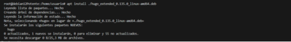
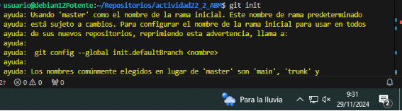
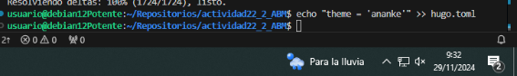
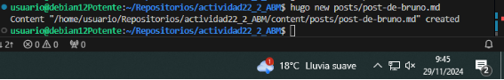
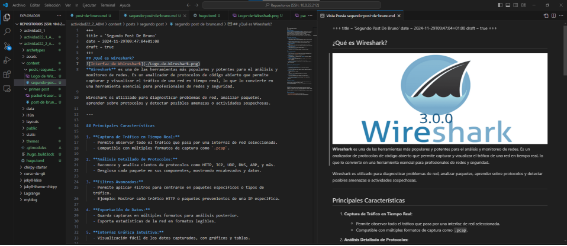
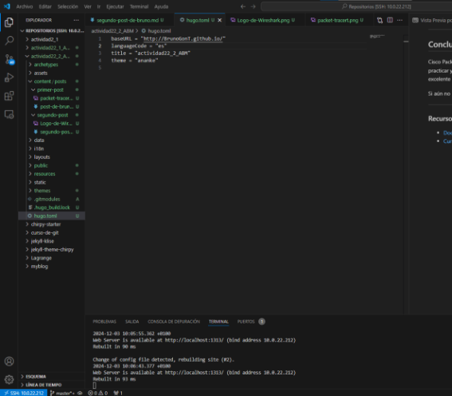
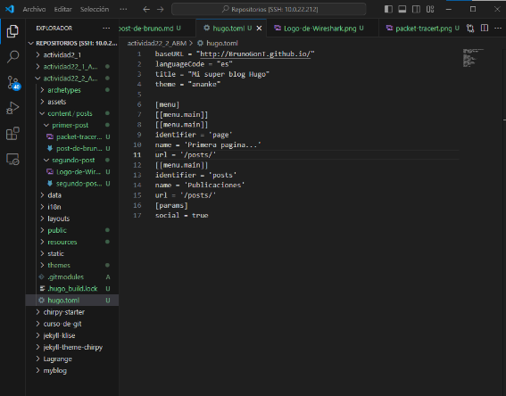
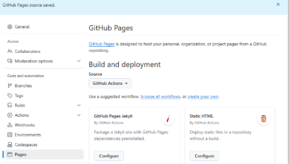

# Guía de Trabajo en Grupo

Esta guía detallo los pasos necesarios para configurar y gestionar un proyecto que incluye GitHub, submódulos, y Netlify.

---

## 1. Instalación del software necesario

### Buscar y descargar el instalador
1. **Localiza el instalador adecuado**:
   - Debe ser un archivo `.deb`. En este caso, utilizamos la versión `135` pero la version extensa.

   

2. **Descarga e instalación**:
   - Descarga el instalador.
   - Procede a instalarlo en tu sistema.

   
   

3. **Verificar la instalación**:
   - Comprueba la versión instalada ejecutando el siguiente comando:
     ```bash
     hugo version
     ```
   - Verifica la salida en la terminal.

   

---

## 2. Configuración del repositorio en GitHub

### Crear y clonar un repositorio
1. **Crear un repositorio en GitHub**:
   - Cree uno llamado actividad22_2_ABM, le hice un git init, el git submodule y el echo. Pero posteriormente le cambio a 1

   
   
   


2. **Creo un post**:
   - Creo el primero

   

   

   - Creo el segundo
   

   


---

## 3. Cambiamos las cosas del toml

1. Cambiamos esto:
   

  


2. **Creamos el menu**:
   -


---

## Subimos al Github


1. **Ponemos los comandos para subirlo**:
 
   


2. **Nos metemos al Github y nos vamos a pages** 
   

2. **Nos metemos en workflows** 
   
   

---

## 5. Subimos a Netlify

1. **Nos metemos dentro**:
   

   
2. **Ponemos esto**:
   
3. **Rellenamos mas cosas**:
   
4. **Vemos que esta todo bien**:
   
5. **Le damos a Open production deploy**:
   
6. **Y vemos que esta todo perfecto**:
   


