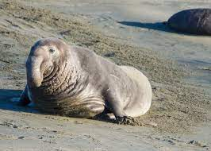
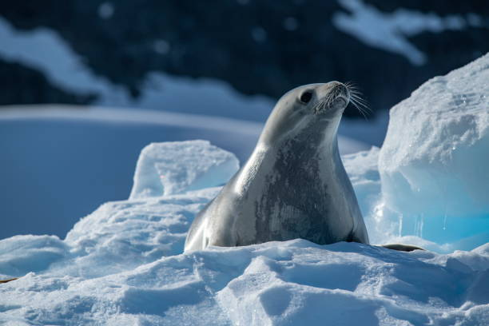

# Las focas

Las focas son mamíferos marinos pertenecientes a la familia **Phocidae**, adaptadas para vivir en ambientes marinos, aunque algunas especies pueden también habitar en zonas terrestres. Existen diversas especies de focas, distribuidas por todos los océanos del mundo. Son conocidas por su agilidad en el agua, su forma de cuerpo aerodinámica y sus habilidades para nadar largas distancias.

## Características físicas

Las focas tienen una serie de características físicas que las hacen perfectamente adaptadas para su vida marina. Tienen un cuerpo alargado, similar a un torpedo, lo que les permite moverse rápidamente en el agua. Además, poseen una gruesa capa de grasa bajo la piel que las ayuda a mantener la temperatura corporal en aguas frías.

1. **Aletas**: Las focas tienen aletas en lugar de patas, lo que les ayuda a nadar de manera eficiente. Las aletas delanteras les sirven para impulsarse hacia adelante, mientras que las traseras las usan para girar y mantener el equilibrio.
   
2. **Pelaje**: Su pelaje es denso y está diseñado para aislarlas del frío. En algunas especies, el pelaje cambia de color o patrón a medida que maduran.

## Tipos de focas

Existen más de 30 especies de focas en el mundo, pero algunas de las más conocidas son:

### 1. **Foca común (Phoca vitulina)**
   - **Descripción**: Es una de las especies más comunes y tiene un tamaño mediano. Su pelaje es generalmente de color gris con manchas oscuras. Se encuentra en las costas de Europa, América del Norte y algunas partes de Asia.
   - **Hábitat**: Prefiere áreas costeras rocosas o playas donde puede descansar y dar a luz.
   
   

### 2. **Foca elefante (Mirounga leonina)**
   - **Descripción**: Esta especie es conocida por su gran tamaño y su distintiva nariz, que se parece a un elefante. Los machos son considerablemente más grandes que las hembras.
   - **Hábitat**: Se encuentra en las islas subantárticas y en las costas del sur de América del Sur.
   
   

### 3. **Foca de Weddell (Leptonychotes weddellii)**
   - **Descripción**: Es una de las focas más profundas y resistentes, capaz de sumergirse hasta 600 metros bajo el agua.
   - **Hábitat**: Vive principalmente en la Antártida, donde se encuentra en aguas heladas.
   
   

## Comportamiento y alimentación

Las focas son animales muy adaptados a su entorno marino, con comportamientos que varían dependiendo de la especie:

- **Alimentación**: Se alimentan principalmente de peces, calamares y pequeños invertebrados. Algunas especies también pueden cazar aves marinas. Tienen un excelente sentido de la vista y el oído bajo el agua, lo que les ayuda a detectar a sus presas.

- **Reproducción**: Las focas suelen dar a luz a sus crías en playas o en el hielo marino. La cría de foca es conocida como "cachorro" y suele ser alimentada con leche rica en grasa durante sus primeros meses.

## Hábitat

Las focas habitan en diversos ambientes marinos, desde las aguas gélidas del Ártico hasta las costas templadas o incluso tropicales. Algunas especies prefieren zonas con hielo marino, donde pueden descansar entre sus migraciones, mientras que otras se encuentran en áreas costeras rocosas.

**Distribución geográfica**:
- **Ártico y subártico**: Hogar de especies como la foca anillada o la foca de Groenlandia.
- **Antártida**: La foca de Weddell y la foca leopardo se encuentran en estas regiones frías.
- **Zonas templadas**: Como la foca común, que habita en la costa de Europa y América del Norte.

## Conservación

La conservación de las focas varía según la especie. Algunas de ellas están en peligro debido a la caza, la pérdida de hábitat y el cambio climático. Es importante mantener su entorno natural libre de contaminación y proteger las áreas donde se reproducen y descansan.

